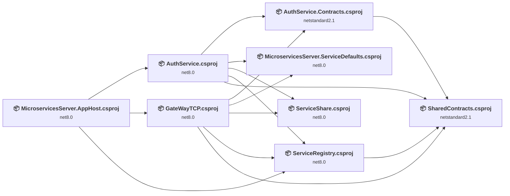
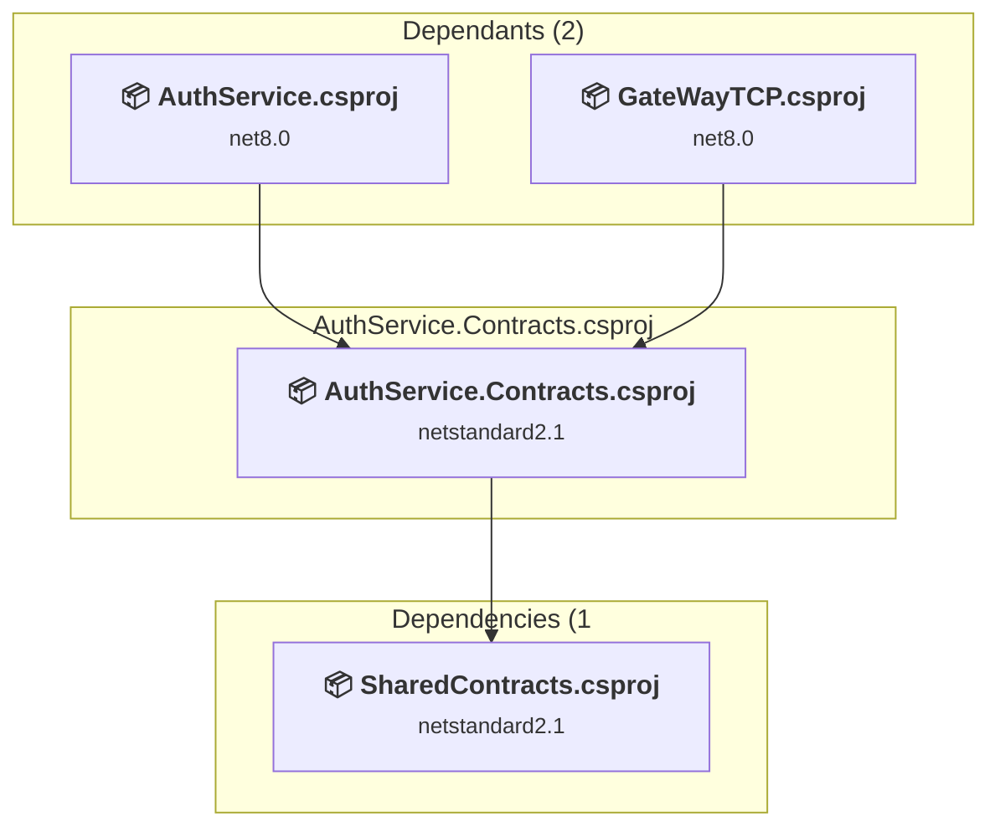
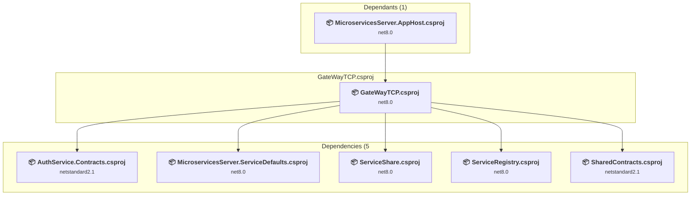
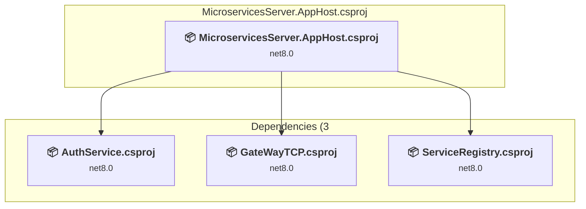
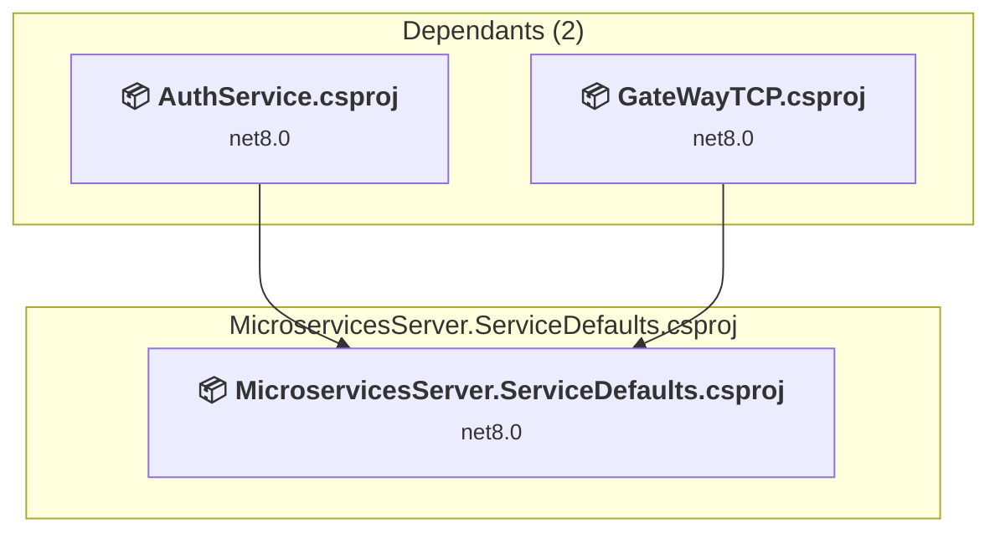
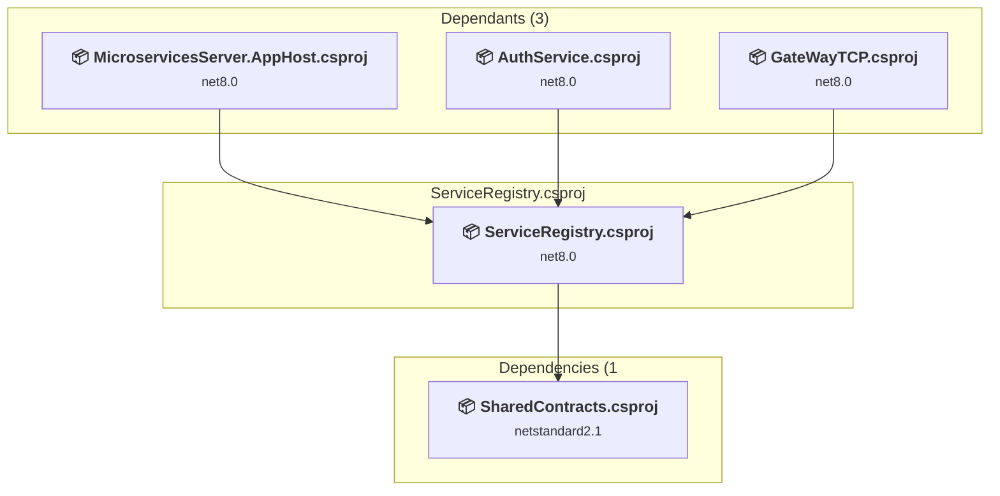
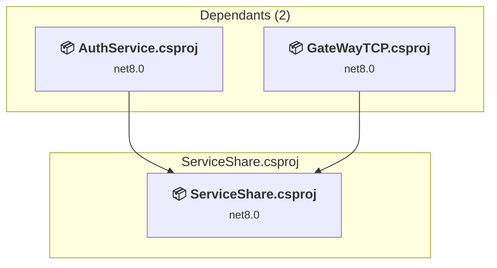
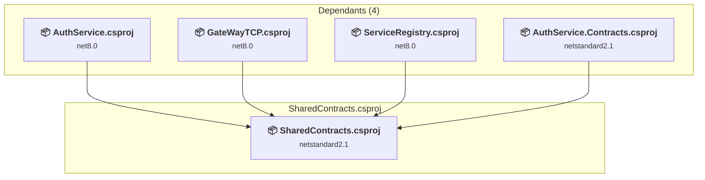

# Projects and dependencies analysis

This document provides a comprehensive overview of the projects and their dependencies in the context of upgrading to .NETCoreApp,Version=v10.0.

## Table of Contents

- [Executive Summary](#executive-Summary)
  - [Highlevel Metrics](#highlevel-metrics)
  - [Projects Compatibility](#projects-compatibility)
  - [Package Compatibility](#package-compatibility)
  - [API Compatibility](#api-compatibility)
- [Aggregate NuGet packages details](#aggregate-nuget-packages-details)
- [Top API Migration Challenges](#top-api-migration-challenges)
  - [Technologies and Features](#technologies-and-features)
  - [Most Frequent API Issues](#most-frequent-api-issues)
- [Projects Relationship Graph](#projects-relationship-graph)
- [Project Details](#project-details)

  - [AuthService.Contracts\AuthService.Contracts.csproj](#authservicecontractsauthservicecontractscsproj)
  - [AuthService\AuthService.csproj](#authserviceauthservicecsproj)
  - [GateWayTCP\GateWayTCP.csproj](#gatewaytcpgatewaytcpcsproj)
  - [MicroservicesServer.AppHost\MicroservicesServer.AppHost.csproj](#microservicesserverapphostmicroservicesserverapphostcsproj)
  - [MicroservicesServer.ServiceDefaults\MicroservicesServer.ServiceDefaults.csproj](#microservicesserverservicedefaultsmicroservicesserverservicedefaultscsproj)
  - [ServiceRegistry\ServiceRegistry.csproj](#serviceregistryserviceregistrycsproj)
  - [ServiceShare\ServiceShare.csproj](#serviceshareservicesharecsproj)
  - [SharedContracts\SharedContracts.csproj](#sharedcontractssharedcontractscsproj)

## Executive Summary

### Highlevel Metrics

| Metric | Count | Status |
| :--- | :---: | :--- |
| Total Projects | 8 | 7 require upgrade |
| Total NuGet Packages | 20 | 11 need upgrade |
| Total Code Files | 42 |  |
| Total Code Files with Incidents | 14 |  |
| Total Lines of Code | 2940 |  |
| Total Number of Issues | 34 |  |
| Estimated LOC to modify | 13+ | at least 0.4% of codebase |

### Projects Compatibility

| Project | Target Framework | Difficulty | Package Issues | API Issues | Est. LOC Impact | Description |
| :--- | :---: | :---: | :---: | :---: | :---: | :--- |
| [AuthService.Contracts\AuthService.Contracts.csproj](#authservicecontractsauthservicecontractscsproj) | netstandard2.1 | ✅ None | 0 | 0 |  | ClassLibrary, Sdk Style = True |
| [AuthService\AuthService.csproj](#authserviceauthservicecsproj) | net8.0 | 🟢 Low | 4 | 3 | 3+ | AspNetCore, Sdk Style = True |
| [GateWayTCP\GateWayTCP.csproj](#gatewaytcpgatewaytcpcsproj) | net8.0 | 🟢 Low | 0 | 5 | 5+ | AspNetCore, Sdk Style = True |
| [MicroservicesServer.AppHost\MicroservicesServer.AppHost.csproj](#microservicesserverapphostmicroservicesserverapphostcsproj) | net8.0 | 🟢 Low | 2 | 0 |  | DotNetCoreApp, Sdk Style = True |
| [MicroservicesServer.ServiceDefaults\MicroservicesServer.ServiceDefaults.csproj](#microservicesserverservicedefaultsmicroservicesserverservicedefaultscsproj) | net8.0 | 🟢 Low | 4 | 0 |  | ClassLibrary, Sdk Style = True |
| [ServiceRegistry\ServiceRegistry.csproj](#serviceregistryserviceregistrycsproj) | net8.0 | 🟢 Low | 0 | 0 |  | AspNetCore, Sdk Style = True |
| [ServiceShare\ServiceShare.csproj](#serviceshareservicesharecsproj) | net8.0 | 🟢 Low | 4 | 5 | 5+ | ClassLibrary, Sdk Style = True |
| [SharedContracts\SharedContracts.csproj](#sharedcontractssharedcontractscsproj) | netstandard2.1 | 🟢 Low | 1 | 0 |  | ClassLibrary, Sdk Style = True |

### Package Compatibility

| Status | Count | Percentage |
| :--- | :---: | :---: |
| ✅ Compatible | 9 | 45.0% |
| ⚠️ Incompatible | 0 | 0.0% |
| 🔄 Upgrade Recommended | 11 | 55.0% |
| ***Total NuGet Packages*** | ***20*** | ***100%*** |

### API Compatibility

| Category | Count | Impact |
| :--- | :---: | :--- |
| 🔴 Binary Incompatible | 4 | High - Require code changes |
| 🟡 Source Incompatible | 5 | Medium - Needs re-compilation and potential conflicting API error fixing |
| 🔵 Behavioral change | 4 | Low - Behavioral changes that may require testing at runtime |
| ✅ Compatible | 2461 |  |
| ***Total APIs Analyzed*** | ***2474*** |  |

## Aggregate NuGet packages details

| Package | Current Version | Suggested Version | Projects | Description |
| :--- | :---: | :---: | :--- | :--- |
| Aspire.Hosting | 9.5.1 |  | [AuthService.csproj](#authserviceauthservicecsproj) | Needs to be replaced with Replace with new package Aspire.Hosting.AppHost=13.1.2 |
| Aspire.Hosting.AppHost | 13.1.0 | 13.1.2 | [MicroservicesServer.AppHost.csproj](#microservicesserverapphostmicroservicesserverapphostcsproj) | NuGet package upgrade is recommended |
| Aspire.Hosting.Kafka | 13.1.0 | 13.1.2 | [MicroservicesServer.AppHost.csproj](#microservicesserverapphostmicroservicesserverapphostcsproj) | NuGet package upgrade is recommended |
| Confluent.Kafka | 2.8.0 |  | [ServiceShare.csproj](#serviceshareservicesharecsproj) | ✅Compatible |
| MessagePack | 3.1.4 |  | [ServiceRegistry.csproj](#serviceregistryserviceregistrycsproj) [ServiceShare.csproj](#serviceshareservicesharecsproj) [SharedContracts.csproj](#sharedcontractssharedcontractscsproj) | ✅Compatible |
| Microsoft.AspNetCore.Authentication.JwtBearer | 8.0.20 | 10.0.5 | [AuthService.csproj](#authserviceauthservicecsproj) | NuGet package upgrade is recommended |
| Microsoft.Extensions.Hosting.Abstractions | 9.0.9 | 10.0.5 | [AuthService.csproj](#authserviceauthservicecsproj) [ServiceShare.csproj](#serviceshareservicesharecsproj) | NuGet package upgrade is recommended |
| Microsoft.Extensions.Http.Resilience | 9.4.0 | 10.4.0 | [MicroservicesServer.ServiceDefaults.csproj](#microservicesserverservicedefaultsmicroservicesserverservicedefaultscsproj) | NuGet package upgrade is recommended |
| Microsoft.Extensions.Logging.Abstractions | 9.0.9 | 10.0.5 | [ServiceShare.csproj](#serviceshareservicesharecsproj) [SharedContracts.csproj](#sharedcontractssharedcontractscsproj) | NuGet package upgrade is recommended |
| Microsoft.Extensions.Options | 9.0.9 | 10.0.5 | [ServiceShare.csproj](#serviceshareservicesharecsproj) | NuGet package upgrade is recommended |
| Microsoft.Extensions.Options.ConfigurationExtensions | 9.0.0 | 10.0.5 | [ServiceShare.csproj](#serviceshareservicesharecsproj) | NuGet package upgrade is recommended |
| Microsoft.Extensions.ServiceDiscovery | 9.3.1 | 10.4.0 | [MicroservicesServer.ServiceDefaults.csproj](#microservicesserverservicedefaultsmicroservicesserverservicedefaultscsproj) | NuGet package upgrade is recommended |
| Microsoft.IdentityModel.JsonWebTokens | 8.14.0 |  | [AuthService.csproj](#authserviceauthservicecsproj) | ✅Compatible |
| MongoDB.Driver | 3.5.0 |  | [AuthService.csproj](#authserviceauthservicecsproj) | ✅Compatible |
| Newtonsoft.Json | 13.0.4 |  | [ServiceShare.csproj](#serviceshareservicesharecsproj) | ✅Compatible |
| OpenTelemetry.Exporter.OpenTelemetryProtocol | 1.9.0 |  | [MicroservicesServer.ServiceDefaults.csproj](#microservicesserverservicedefaultsmicroservicesserverservicedefaultscsproj) | ✅Compatible |
| OpenTelemetry.Extensions.Hosting | 1.9.0 |  | [MicroservicesServer.ServiceDefaults.csproj](#microservicesserverservicedefaultsmicroservicesserverservicedefaultscsproj) | ✅Compatible |
| OpenTelemetry.Instrumentation.AspNetCore | 1.9.0 | 1.15.1 | [MicroservicesServer.ServiceDefaults.csproj](#microservicesserverservicedefaultsmicroservicesserverservicedefaultscsproj) | NuGet package upgrade is recommended |
| OpenTelemetry.Instrumentation.Http | 1.9.0 | 1.15.0 | [MicroservicesServer.ServiceDefaults.csproj](#microservicesserverservicedefaultsmicroservicesserverservicedefaultscsproj) | NuGet package upgrade is recommended |
| OpenTelemetry.Instrumentation.Runtime | 1.9.0 |  | [MicroservicesServer.ServiceDefaults.csproj](#microservicesserverservicedefaultsmicroservicesserverservicedefaultscsproj) | ✅Compatible |

## Top API Migration Challenges

### Technologies and Features

| Technology | Issues | Percentage | Migration Path |
| :--- | :---: | :---: | :--- |

### Most Frequent API Issues

| API | Count | Percentage | Category |
| :--- | :---: | :---: | :--- |
| M:System.TimeSpan.FromSeconds(System.Double) | 5 | 38.5% | Source Incompatible |
| M:Microsoft.Extensions.DependencyInjection.OptionsConfigurationServiceCollectionExtensions.Configure''1(Microsoft.Extensions.DependencyInjection.IServiceCollection,Microsoft.Extensions.Configuration.IConfiguration) | 3 | 23.1% | Binary Incompatible |
| T:System.Uri | 1 | 7.7% | Behavioral Change |
| M:System.Uri.#ctor(System.String) | 1 | 7.7% | Behavioral Change |
| M:Microsoft.Extensions.Logging.ConsoleLoggerExtensions.AddSimpleConsole(Microsoft.Extensions.Logging.ILoggingBuilder,System.Action{Microsoft.Extensions.Logging.Console.SimpleConsoleFormatterOptions}) | 1 | 7.7% | Behavioral Change |
| M:Microsoft.Extensions.DependencyInjection.HttpClientFactoryServiceCollectionExtensions.AddHttpClient(Microsoft.Extensions.DependencyInjection.IServiceCollection) | 1 | 7.7% | Behavioral Change |
| M:Microsoft.Extensions.Configuration.ConfigurationBinder.GetValue''1(Microsoft.Extensions.Configuration.IConfiguration,System.String) | 1 | 7.7% | Binary Incompatible |

## Projects Relationship Graph

Legend:
📦 SDK-style project
⚙️ Classic project

## Project Details

### AuthService.Contracts\AuthService.Contracts.csproj

#### Project Info

- **Current Target Framework:** netstandard2.1✅
- **SDK-style**: True
- **Project Kind:** ClassLibrary
- **Dependencies**: 1
- **Dependants**: 2
- **Number of Files**: 6
- **Lines of Code**: 78
- **Estimated LOC to modify**: 0+ (at least 0.0% of the project)

#### Dependency Graph

Legend:
📦 SDK-style project
⚙️ Classic project

### API Compatibility

| Category | Count | Impact |
| :--- | :---: | :--- |
| 🔴 Binary Incompatible | 0 | High - Require code changes |
| 🟡 Source Incompatible | 0 | Medium - Needs re-compilation and potential conflicting API error fixing |
| 🔵 Behavioral change | 0 | Low - Behavioral changes that may require testing at runtime |
| ✅ Compatible | 57 |  |
| ***Total APIs Analyzed*** | ***57*** |  |

### AuthService\AuthService.csproj

#### Project Info

- **Current Target Framework:** net8.0
- **Proposed Target Framework:** net10.0
- **SDK-style**: True
- **Project Kind:** AspNetCore
- **Dependencies**: 5
- **Dependants**: 1
- **Number of Files**: 9
- **Number of Files with Incidents**: 3
- **Lines of Code**: 334
- **Estimated LOC to modify**: 3+ (at least 0.9% of the project)

#### Dependency Graph

Legend:
📦 SDK-style project
⚙️ Classic project

### API Compatibility

| Category | Count | Impact |
| :--- | :---: | :--- |
| 🔴 Binary Incompatible | 1 | High - Require code changes |
| 🟡 Source Incompatible | 2 | Medium - Needs re-compilation and potential conflicting API error fixing |
| 🔵 Behavioral change | 0 | Low - Behavioral changes that may require testing at runtime |
| ✅ Compatible | 310 |  |
| ***Total APIs Analyzed*** | ***313*** |  |

### GateWayTCP\GateWayTCP.csproj

#### Project Info

- **Current Target Framework:** net8.0
- **Proposed Target Framework:** net10.0
- **SDK-style**: True
- **Project Kind:** AspNetCore
- **Dependencies**: 5
- **Dependants**: 1
- **Number of Files**: 9
- **Number of Files with Incidents**: 3
- **Lines of Code**: 464
- **Estimated LOC to modify**: 5+ (at least 1.1% of the project)

#### Dependency Graph

Legend:
📦 SDK-style project
⚙️ Classic project

### API Compatibility

| Category | Count | Impact |
| :--- | :---: | :--- |
| 🔴 Binary Incompatible | 1 | High - Require code changes |
| 🟡 Source Incompatible | 0 | Medium - Needs re-compilation and potential conflicting API error fixing |
| 🔵 Behavioral change | 4 | Low - Behavioral changes that may require testing at runtime |
| ✅ Compatible | 365 |  |
| ***Total APIs Analyzed*** | ***370*** |  |

### MicroservicesServer.AppHost\MicroservicesServer.AppHost.csproj

#### Project Info

- **Current Target Framework:** net8.0
- **Proposed Target Framework:** net10.0
- **SDK-style**: True
- **Project Kind:** DotNetCoreApp
- **Dependencies**: 3
- **Dependants**: 0
- **Number of Files**: 1
- **Number of Files with Incidents**: 1
- **Lines of Code**: 33
- **Estimated LOC to modify**: 0+ (at least 0.0% of the project)

#### Dependency Graph

Legend:
📦 SDK-style project
⚙️ Classic project

### API Compatibility

| Category | Count | Impact |
| :--- | :---: | :--- |
| 🔴 Binary Incompatible | 0 | High - Require code changes |
| 🟡 Source Incompatible | 0 | Medium - Needs re-compilation and potential conflicting API error fixing |
| 🔵 Behavioral change | 0 | Low - Behavioral changes that may require testing at runtime |
| ✅ Compatible | 72 |  |
| ***Total APIs Analyzed*** | ***72*** |  |

### MicroservicesServer.ServiceDefaults\MicroservicesServer.ServiceDefaults.csproj

#### Project Info

- **Current Target Framework:** net8.0
- **Proposed Target Framework:** net10.0
- **SDK-style**: True
- **Project Kind:** ClassLibrary
- **Dependencies**: 0
- **Dependants**: 2
- **Number of Files**: 1
- **Number of Files with Incidents**: 1
- **Lines of Code**: 127
- **Estimated LOC to modify**: 0+ (at least 0.0% of the project)

#### Dependency Graph

Legend:
📦 SDK-style project
⚙️ Classic project

### API Compatibility

| Category | Count | Impact |
| :--- | :---: | :--- |
| 🔴 Binary Incompatible | 0 | High - Require code changes |
| 🟡 Source Incompatible | 0 | Medium - Needs re-compilation and potential conflicting API error fixing |
| 🔵 Behavioral change | 0 | Low - Behavioral changes that may require testing at runtime |
| ✅ Compatible | 122 |  |
| ***Total APIs Analyzed*** | ***122*** |  |

### ServiceRegistry\ServiceRegistry.csproj

#### Project Info

- **Current Target Framework:** net8.0
- **Proposed Target Framework:** net10.0
- **SDK-style**: True
- **Project Kind:** AspNetCore
- **Dependencies**: 1
- **Dependants**: 3
- **Number of Files**: 5
- **Number of Files with Incidents**: 1
- **Lines of Code**: 117
- **Estimated LOC to modify**: 0+ (at least 0.0% of the project)

#### Dependency Graph

Legend:
📦 SDK-style project
⚙️ Classic project

### API Compatibility

| Category | Count | Impact |
| :--- | :---: | :--- |
| 🔴 Binary Incompatible | 0 | High - Require code changes |
| 🟡 Source Incompatible | 0 | Medium - Needs re-compilation and potential conflicting API error fixing |
| 🔵 Behavioral change | 0 | Low - Behavioral changes that may require testing at runtime |
| ✅ Compatible | 128 |  |
| ***Total APIs Analyzed*** | ***128*** |  |

### ServiceShare\ServiceShare.csproj

#### Project Info

- **Current Target Framework:** net8.0
- **Proposed Target Framework:** net10.0
- **SDK-style**: True
- **Project Kind:** ClassLibrary
- **Dependencies**: 0
- **Dependants**: 2
- **Number of Files**: 6
- **Number of Files with Incidents**: 4
- **Lines of Code**: 587
- **Estimated LOC to modify**: 5+ (at least 0.9% of the project)

#### Dependency Graph

Legend:
📦 SDK-style project
⚙️ Classic project

### API Compatibility

| Category | Count | Impact |
| :--- | :---: | :--- |
| 🔴 Binary Incompatible | 2 | High - Require code changes |
| 🟡 Source Incompatible | 3 | Medium - Needs re-compilation and potential conflicting API error fixing |
| 🔵 Behavioral change | 0 | Low - Behavioral changes that may require testing at runtime |
| ✅ Compatible | 706 |  |
| ***Total APIs Analyzed*** | ***711*** |  |

### SharedContracts\SharedContracts.csproj

#### Project Info

- **Current Target Framework:** netstandard2.1✅
- **SDK-style**: True
- **Project Kind:** ClassLibrary
- **Dependencies**: 0
- **Dependants**: 4
- **Number of Files**: 10
- **Number of Files with Incidents**: 1
- **Lines of Code**: 1200
- **Estimated LOC to modify**: 0+ (at least 0.0% of the project)

#### Dependency Graph

Legend:
📦 SDK-style project
⚙️ Classic project

### API Compatibility

| Category | Count | Impact |
| :--- | :---: | :--- |
| 🔴 Binary Incompatible | 0 | High - Require code changes |
| 🟡 Source Incompatible | 0 | Medium - Needs re-compilation and potential conflicting API error fixing |
| 🔵 Behavioral change | 0 | Low - Behavioral changes that may require testing at runtime |
| ✅ Compatible | 701 |  |
| ***Total APIs Analyzed*** | ***701*** |  |

