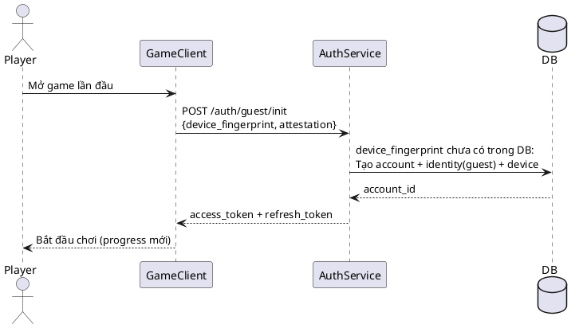

```plantuml
@startuml
actor Player
participant GameClient as Client
participant AuthService as Auth
database DB

Player -> Client: Mở game lần đầu
Client -> Auth: POST /auth/guest/init\n{device_fingerprint, attestation}
Auth -> DB: device_fingerprint chưa có trong DB:\nTạo account + identity(guest) + device
DB --> Auth: account_id
Auth --> Client: access_token + refresh_token
Client --> Player: Bắt đầu chơi (progress mới)
@enduml
```